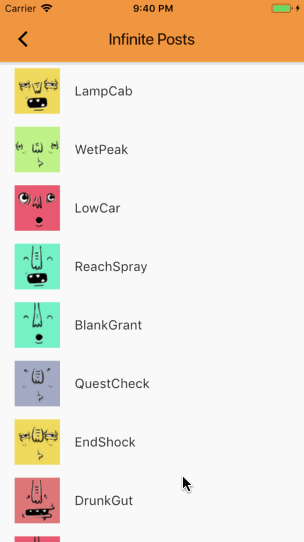
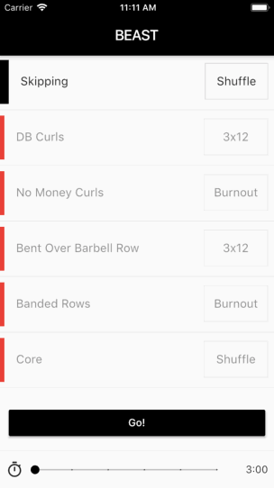

# Flutterby

Each [branch](https://github.com/oodavid/flutterby/branches) contains the sources for [my videos on YouTube](https://www.youtube.com/channel/UCMBdBkoT5Hg-ZVYmrnPOncg).

1. [![][youtube] Flutter :: From StreamBuilder to MultiProvider](https://youtu.be/budqAnwn740) - view the [source code](https://gist.github.com/oodavid/13bbd9fe0282cec3c2c35283ef55b336)

1. [![][youtube] Flutter :: Infinite loading and pull-to-refresh - the right way!](https://youtu.be/hbtYcp0Rnp0) - view the [source code](https://github.com/oodavid/flutterby/tree/2-infinite-loading-pull-to-refresh)

1. [![][youtube] Flutter :: Show & Hide Passwords - without the overhead!](https://youtu.be/kpaBG_MKgd4) - view the [source code](https://github.com/oodavid/flutterby/tree/3-show-hide-password)

1. [![][youtube] Flutter :: Improving The Beast List 💪](https://youtu.be/CRGvMsZU7Ac)

---

[youtube]: img/youtube.png