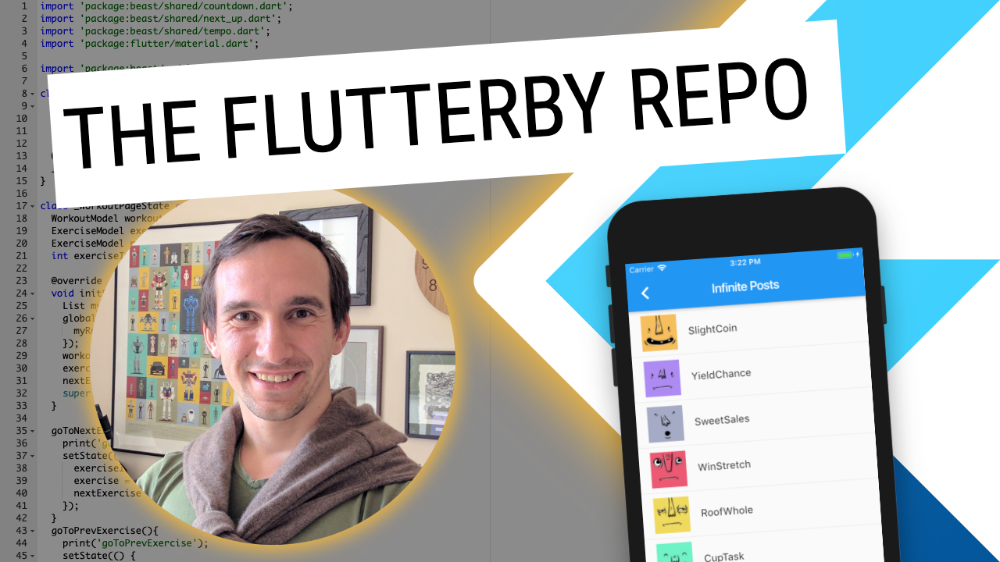
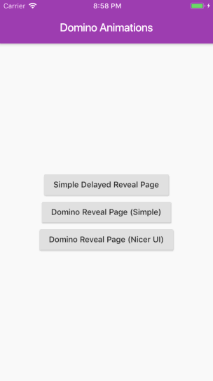
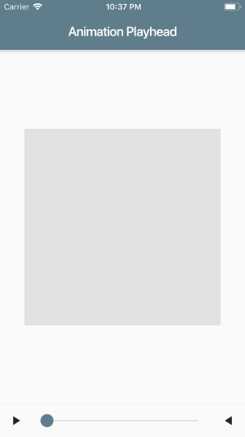
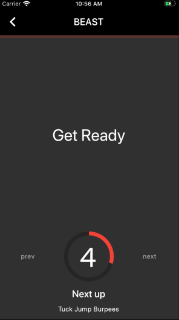

# Flutterby

Each directroy contains the sources for [my videos on YouTube](https://www.youtube.com/channel/UCMBdBkoT5Hg-ZVYmrnPOncg).

1. [![][youtube] Flutter :: From StreamBuilder to MultiProvider](https://youtu.be/budqAnwn740) - view the [source code](/001-streambuilder-to-multiprovider)

1. [![][youtube] Flutter :: Infinite loading and pull-to-refresh - the right way!](https://youtu.be/hbtYcp0Rnp0) - view the [source code](/002-infinite-loading-pull-to-refresh)

1. [![][youtube] Flutter :: Show & Hide Passwords - without the overhead!](https://youtu.be/kpaBG_MKgd4) - view the [source code](/003-show-hide-password)

1. [![][youtube] Flutter :: BEAST DevLog :: Improving UI and UX 💪](https://youtu.be/CRGvMsZU7Ac)

1. [![][youtube] Flutter :: The Domino Effect. Lazy animations that look great!!](https://youtu.be/EVFawsxBafo) - view the [source code](/005-domino-animations)

1. [![][youtube] Flutter :: The Animation playhead is so fun!](https://youtu.be/P-73Hv1vjJU) - view the [source code](/006-animation-playhead)

1. [![][youtube] Flutter :: BEAST DevLog :: Shuffle Workouts](https://youtu.be/NbGmYedrI1c)

---

[youtube]: assets/youtube.png