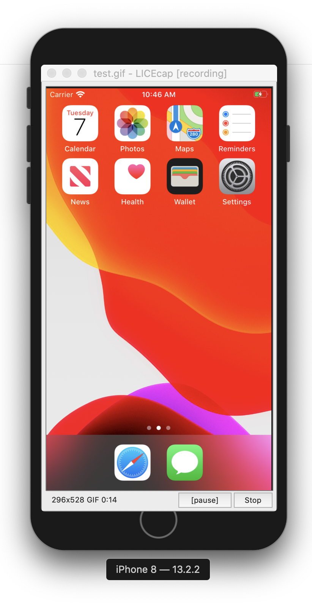

# Making GIFs

* Use iPhone 8 Simulator
* Set to "Physical Size"
   * Simulator > Window > Physical Size
* Use LICEcap for recording
   * Dimensions 296 x 528
   * 30fps
   * See screenshot below for alignment (it doesn't look right, but it is)
   * Not working on iOS Catalina?
      * https://github.com/justinfrankel/licecap/issues/71#issuecomment-531507490

### LICEcap alignment

